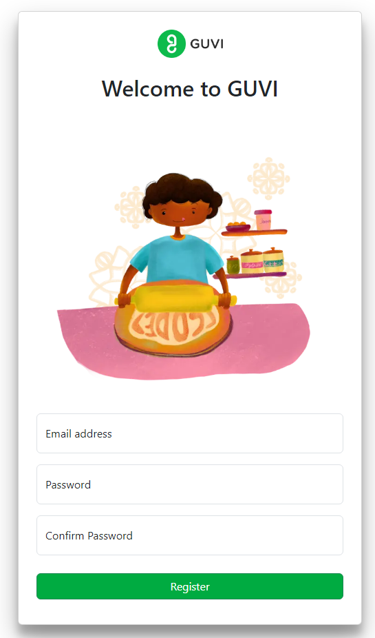

# A demo of a simple microservice application

### Description

This is a simple demo of a microservice architecture where in the flow is as below: 

- Registering a user -> using email and password. 
- Login-> using registered credentials. 
- Profile -> where the user can view and edit the basic profile information.

### Components

- Frontend is built using HTML,CSS,Bootstrap and Font Awesome Icons.
- Interacting with the backend is only using JQuery AJAX (no usage of form submission)
- Server-side scripting is with PHP
- User credentials are stored in MYSQL Database.
- Profile information is stored in MongoDB.
- Client side session is maintained using browser localStorage.
- Server side session is maintained using Redis.

### Instructions

- Download this repository.
- Install [XAMPP](https://www.apachefriends.org/) for PHP Development environment.
- Move the downloaded repository to the path: :\xampp\htdocs\.
- Download the [MongoDB_Compass](https://www.mongodb.com/products/compass) and [Redis](https://github.com/microsoftarchive/redis/releases).
- Download the [MONGODB](https://pecl.php.net/package/mongodb) and [REDIS](https://pecl.php.net/package/redis) .dll files compatible with your PHP version.
- Please Refer [MONGO](https://www.geeksforgeeks.org/how-to-install-mongodb-driver-in-php/) and [Redis](https://github.com/phpredis/phpredis/blob/develop/INSTALL.md) for installing extensions for XAMPP.
- Download [Composer](https://getcomposer.org/download/).
- For configuring [Redis_Session_Handler](https://github.com/phpredis/phpredis#php-session-handler).
- Do update the redis port inplace of host1/host2 while configuring session_path
- Open XAMPP Control Panel and start Apache server and MySQL server and open the Apache admin interface and type the path to the project directory.
  eg : `localhost/auth-profile-microservice` and the app gets started.

### Demo

